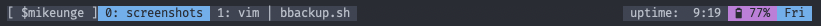

# batstat 🔌
Small battery status for the command-line - ⚠️ Mac OS only ⚠️

## _about
`batstat.sh` is a small but beautiful solution for your terminal.
I develeoped it to use it with `tmux` and it fits in perfect (*see screenshots*).

Make sure your terminal supports **Nerd Fonts** else the used icons will not be displayed.

If you find any bugs or weird behavior, please create a `issue` and if you want to contribute, feel free and create a PR
or fork the repo.

## _icons
Big thanks to  for providing all the used icons.

## _screenshots
> all configs are on github, just check my `dotfiles` repository

Battery (*batstat.sh*) is in action to the right. 
